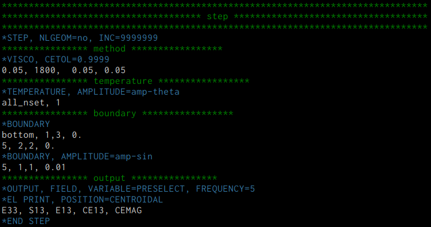

# inp-mode

Emacs major mode for ABAQUS inp file.

<!-- ================================================================================ -->
<!-- ================================================================================ -->
## Features
* Syntax highlighting
* Comment/Uncomment function (Start with `**`)

<!-- ================================================================================ -->
<!-- ================================================================================ -->
## Syntax highlighting

```inp
**COMMENT
*KEYWORD, OPTION1, OPTION2=VALUE2, ...
DATA1, DATA2, DATA3, ...
```

| Line           | Face                     |
|----------------|--------------------------|
| `**COMMENT...` | `font-lock-comment-face` |
| `*KEYWORD...`  | `font-lock-keyword-face` |
| `DATA1, ...`   | NONE                     |

<!-- ================================================================================ -->
<!-- ================================================================================ -->
## Screenshot



<!-- ================================================================================ -->
<!-- ================================================================================ -->
## Installation

1. `git clone https://gitlab.com/ryunosuke_yamashita/inp-mode.git`
2. Add following lines to your `~/.emacs`:

```elisp
(add-to-list 'load-path "/path/to/inp-mode")
(require 'inp-mode)
(add-to-list 'auto-mode-alist '("\\.inp\\'" . inp-mode))
```
