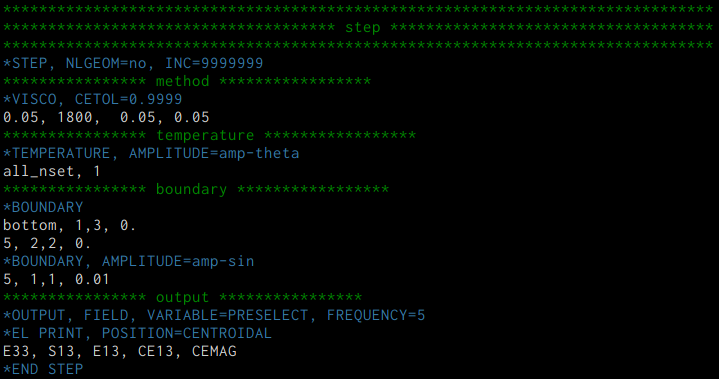

# inp-mode

Emacs major mode for ABAQUS inp file.

<!-- ================================================================================ -->
<!-- ================================================================================ -->
## Features
* Syntax highlighting
* Comment/Uncomment function (Start with `**`)

<!-- ================================================================================ -->
<!-- ================================================================================ -->
## Syntax highlighting

```inp
**COMMENT
*KEYWORD, OPTION1, OPTION2=VALUE2, ...
DATA1, DATA2, DATA3, ...
```

| Line           | Face                     |
|----------------|--------------------------|
| `**COMMENT...` | `comment-face`           |
| `*KEYWORD...`  | `font-lock-keyword-face` |
| `DATA1, ...`   | NONE                     |

<!-- ================================================================================ -->
<!-- ================================================================================ -->
## Screenshot


